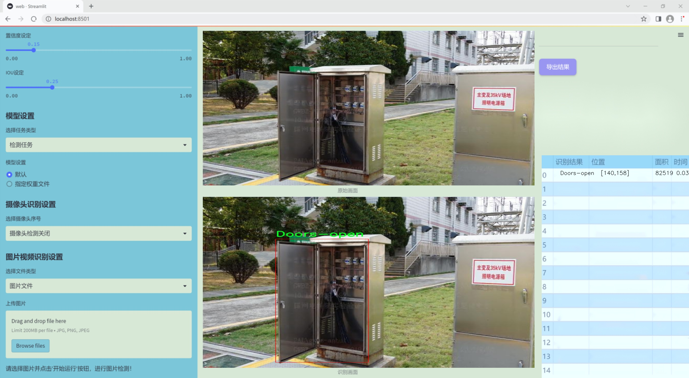
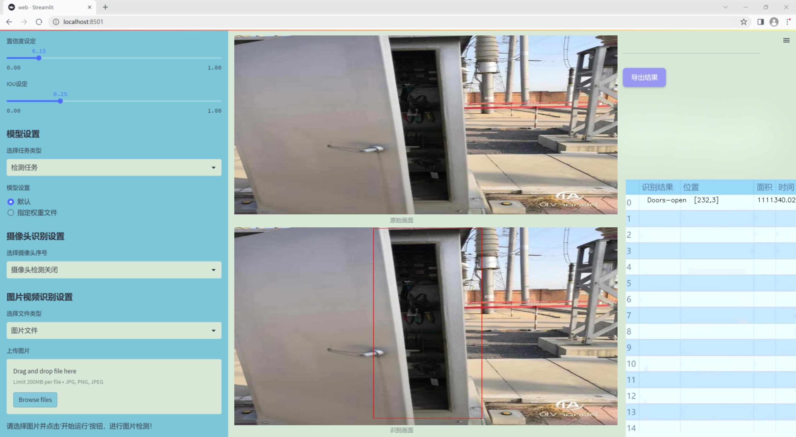
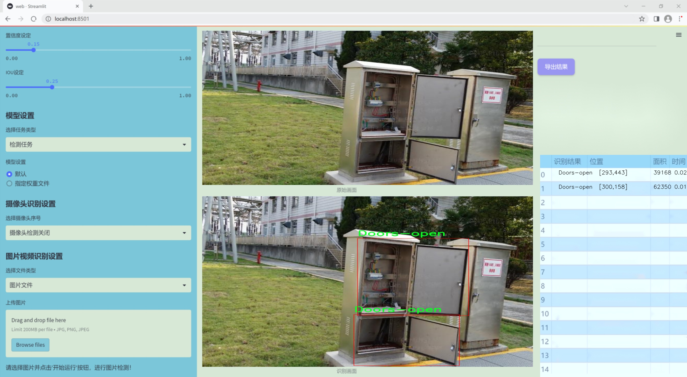
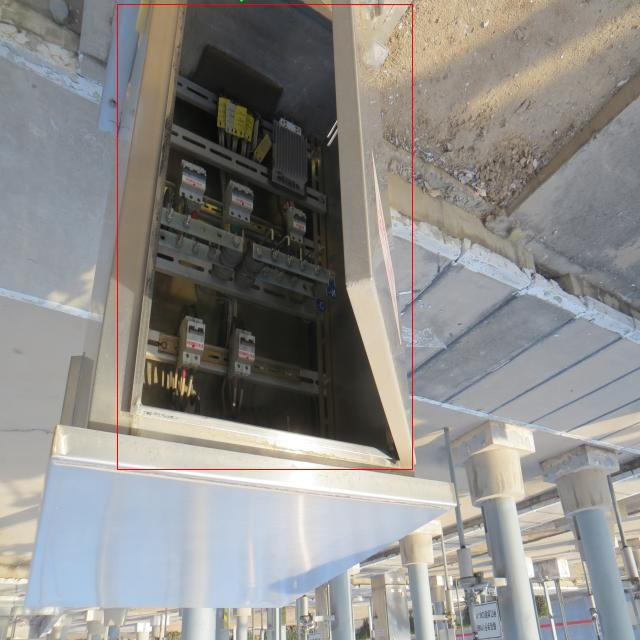
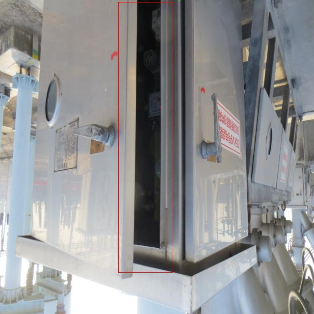
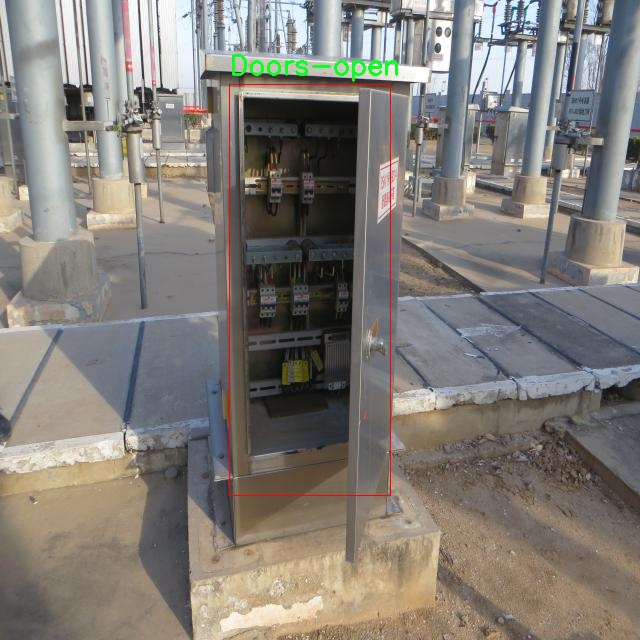
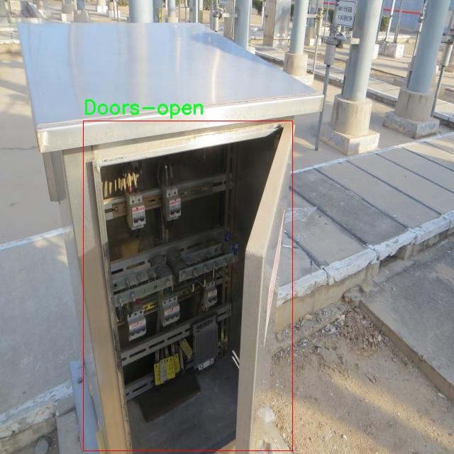
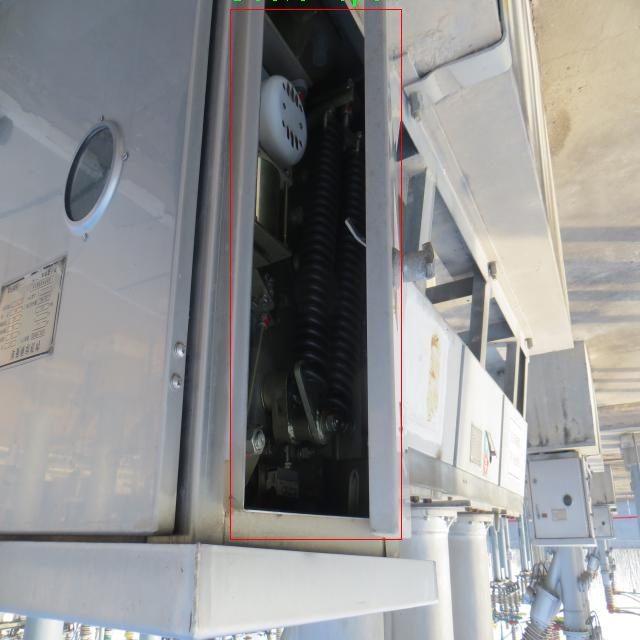

### 1.背景意义

研究背景与意义

在现代工业和商业环境中，电气柜作为重要的电力控制和分配设备，其安全性和可靠性至关重要。电气柜门未关可能导致设备故障、人员伤害甚至火灾等严重后果。因此，及时检测电气柜门的状态，尤其是未关状态，成为保障安全的重要任务。传统的人工巡检方法不仅效率低下，而且容易受到人为因素的影响，难以保证检测的准确性和及时性。因此，基于计算机视觉的自动检测系统应运而生，成为解决这一问题的有效手段。

本研究旨在开发一个基于改进YOLOv11模型的电气柜门未关检测系统。YOLO（You Only Look Once）系列模型以其高效的实时目标检测能力而闻名，能够在保证检测精度的同时实现快速处理。通过对YOLOv11进行改进，我们期望在复杂环境中提高电气柜门未关状态的检测准确率。为此，我们构建了一个专门的数据集，包含435张经过精心标注的电气柜门图像，涵盖了“Doors-open”这一类别。数据集的构建过程包括图像的自动方向调整、尺寸标准化及多样化增强处理，确保模型训练时能够接触到丰富的样本。

通过这一系统的实现，我们不仅能够提高电气柜门未关状态的检测效率，还能为相关行业提供一种可行的安全监控解决方案。该系统的推广应用将有助于减少因电气柜门未关而引发的安全隐患，提升整体安全管理水平。同时，本研究也为计算机视觉技术在工业安全领域的应用提供了新的思路和实践基础，推动相关技术的进一步发展与创新。

### 2.视频效果

[2.1 视频效果](https://www.bilibili.com/video/BV12zBvYmEaW/)

### 3.图片效果







##### [项目涉及的源码数据来源链接](https://kdocs.cn/l/cszuIiCKVNis)**

注意：本项目提供训练的数据集和训练教程,由于版本持续更新,暂不提供权重文件（best.pt）,请按照6.训练教程进行训练后实现上图演示的效果。

### 4.数据集信息

##### 4.1 本项目数据集类别数＆类别名

nc: 1
names: ['Doors-open']


该项目为【目标检测】数据集，请在【训练教程和Web端加载模型教程（第三步）】这一步的时候按照【目标检测】部分的教程来训练

##### 4.2 本项目数据集信息介绍

本项目数据集信息介绍

本项目所使用的数据集专注于电气柜门未关检测系统的训练，旨在提升YOLOv11模型在该特定任务上的性能。数据集的主题围绕“电气柜”展开，特别关注电气柜门的状态，以便实现对未关门情况的准确识别。数据集中包含的类别数量为1，具体类别为“Doors-open”，即电气柜门处于打开状态的图像。这一单一类别的设计使得模型能够专注于学习电气柜门打开时的特征，减少了因类别多样性带来的复杂性。

在数据集的构建过程中，收集了大量的电气柜门打开状态的图像，这些图像来自于不同的环境和条件，以确保模型在各种实际应用场景中都能表现出色。数据集中的图像涵盖了不同类型的电气柜，包含了多种颜色、形状和尺寸的柜门，旨在提高模型的泛化能力。此外，图像采集过程中还考虑了不同的光照条件和拍摄角度，以模拟真实世界中可能遇到的各种情况。这种多样性为模型的训练提供了丰富的样本，有助于提高其对电气柜门打开状态的识别准确性。

在数据标注方面，所有图像均经过精确标注，确保每个图像中电气柜门打开的区域被准确框定。这一细致的标注工作为后续的模型训练奠定了坚实的基础，使得YOLOv11能够在学习过程中有效地提取出电气柜门打开的特征信息。通过对这一数据集的充分利用，本项目旨在开发出一个高效、可靠的电气柜门未关检测系统，以提升电气设备的安全性和管理效率。











### 5.全套项目环境部署视频教程（零基础手把手教学）

[5.1 所需软件PyCharm和Anaconda安装教程（第一步）](https://www.bilibili.com/video/BV1BoC1YCEKi/?spm_id_from=333.999.0.0&vd_source=bc9aec86d164b67a7004b996143742dc)


[5.2 安装Python虚拟环境创建和依赖库安装视频教程（第二步）](https://www.bilibili.com/video/BV1ZoC1YCEBw?spm_id_from=333.788.videopod.sections&vd_source=bc9aec86d164b67a7004b996143742dc)

### 6.改进YOLOv11训练教程和Web_UI前端加载模型教程（零基础手把手教学）

[6.1 改进YOLOv11训练教程和Web_UI前端加载模型教程（第三步）](https://www.bilibili.com/video/BV1BoC1YCEhR?spm_id_from=333.788.videopod.sections&vd_source=bc9aec86d164b67a7004b996143742dc)


按照上面的训练视频教程链接加载项目提供的数据集，运行train.py即可开始训练



     Epoch   gpu_mem       box       obj       cls    labels  img_size
     1/200     20.8G   0.01576   0.01955  0.007536        22      1280: 100%|██████████| 849/849 [14:42<00:00,  1.04s/it]
               Class     Images     Labels          P          R     mAP@.5 mAP@.5:.95: 100%|██████████| 213/213 [01:14<00:00,  2.87it/s]
                 all       3395      17314      0.994      0.957      0.0957      0.0843

     Epoch   gpu_mem       box       obj       cls    labels  img_size
     2/200     20.8G   0.01578   0.01923  0.007006        22      1280: 100%|██████████| 849/849 [14:44<00:00,  1.04s/it]
               Class     Images     Labels          P          R     mAP@.5 mAP@.5:.95: 100%|██████████| 213/213 [01:12<00:00,  2.95it/s]
                 all       3395      17314      0.996      0.956      0.0957      0.0845

     Epoch   gpu_mem       box       obj       cls    labels  img_size
     3/200     20.8G   0.01561    0.0191  0.006895        27      1280: 100%|██████████| 849/849 [10:56<00:00,  1.29it/s]
               Class     Images     Labels          P          R     mAP@.5 mAP@.5:.95: 100%|███████   | 187/213 [00:52<00:00,  4.04it/s]
                 all       3395      17314      0.996      0.957      0.0957      0.0845


###### [项目数据集下载链接](https://kdocs.cn/l/cszuIiCKVNis)

### 7.原始YOLOv11算法讲解

YOLOv11是一种由Ultralytics公司开发的最新一代目标检测模型，以其增强的特征提取能力和更高的效率在计算机视觉领域引人注目。该模型在架构上进行了关键升级，通过更新主干和颈部结构，显著提高了对复杂视觉场景的理解和处理精度。YOLOv11不仅在目标检测上表现出色，还支持实例分割、图像分类、姿态估计和定向目标检测（OBB）等任务，展示出其多功能性。

与其前身YOLOv8相比，YOLOv11在设计上实现了深度和宽度的改变，同时引入了几个创新机制。其中，C3k2机制是对YOLOv8中的C2f的改进，提升了浅层特征的处理能力；C2PSA机制则进一步优化了特征图的处理流程。解耦头的创新设计，通过增加两个深度卷积（DWConv），提高了模型对细节的感知能力和分类准确性。

在性能上，YOLOv11m模型在COCO数据集上的平均精度（mAP）提高，并减少了22%的参数量，确保了在运算效率上的突破。该模型可以部署在多种平台上，包括边缘设备、云平台以及支持NVIDIA GPU的系统，彰显出卓越的灵活性和适应性。总体而言，YOLOv11通过一系列的创新突破，对目标检测领域产生了深远的影响，并为未来的开发提供了新的研究方向。


****文档**** ： _ _https://docs.ultralytics.com/models/yolo11/__

****代码链接**** ： _ _https://github.com/ultralytics/ultralytics__

******Performance Metrics******


​ ** **关键特性****

****◆**** ** **增强的特征提取能力**** ：YOLO11采用了改进的主干和颈部架构，增强了 ** **特征提取****
能力，能够实现更精确的目标检测和复杂任务的执行。

****◆**** ** **优化的效率和速度****
：YOLO11引入了精细化的架构设计和优化的训练流程，提供更快的处理速度，并在准确性和性能之间保持最佳平衡。

****◆**** ** **参数更少、精度更高****
：通过模型设计的改进，YOLO11m在COCO数据集上实现了更高的平均精度（mAP），同时使用的参数比YOLOv8m少22%，使其在计算上更加高效，而不牺牲准确性。

****◆**** ** **跨环境的适应性**** ：YOLO11可以无缝部署在各种环境中，包括边缘设备、云平台和支持NVIDIA
GPU的系统，确保最大的灵活性。

****◆**** ** **支持广泛任务****
：无论是目标检测、实例分割、图像分类、姿态估计还是定向目标检测（OBB），YOLO11都旨在应对一系列计算机视觉挑战。

****支持的任务和模式****


​YOLO11建立在YOLOv8中引入的多功能模型范围之上，为各种计算机视觉任务提供增强的支持:


​该表提供了YOLO11模型变体的概述，展示了它们在特定任务中的适用性以及与Inference、Validation、Training和Export等操作模式的兼容性。从实时检测到复杂的分割任务
，这种灵活性使YOLO11适用于计算机视觉的广泛应用。

##### yolov11的创新

■ yolov8 VS yolov11

YOLOv5，YOLOv8和YOLOv11均是ultralytics公司的作品，ultralytics出品必属精品。


​ **具体创新点** ：

**① 深度（depth）和宽度 （width）**

YOLOv8和YOLOv11是基本上完全不同。

**② C3k2机制**

C3k2有参数为c3k，其中在网络的浅层c3k设置为False。C3k2就相当于YOLOv8中的C2f。


​ **③ C2PSA机制**

下图为C2PSA机制的原理图。


​ **④ 解耦头**

解耦头中的分类检测头增加了两个 **DWConv** 。


▲Conv

    
    
    def autopad(k, p=None, d=1):  # kernel, padding, dilation
    
        """Pad to 'same' shape outputs."""
    
        if d > 1:
    
            k = d * (k - 1) + 1 if isinstance(k, int) else [d * (x - 1) + 1 for x in k]  # actual kernel-size
    
        if p is None:
    
            p = k // 2 if isinstance(k, int) else [x // 2 for x in k]  # auto-pad
    
    return p
    
    
    class Conv(nn.Module):
    
        """Standard convolution with args(ch_in, ch_out, kernel, stride, padding, groups, dilation, activation)."""
    
    
        default_act = nn.SiLU()  # default activation
    
    
        def __init__(self, c1, c2, k=1, s=1, p=None, g=1, d=1, act=True):
    
            """Initialize Conv layer with given arguments including activation."""
    
            super().__init__()
    
            self.conv = nn.Conv2d(c1, c2, k, s, autopad(k, p, d), groups=g, dilation=d, bias=False)
    
            self.bn = nn.BatchNorm2d(c2)
    
            self.act = self.default_act if act is True else act if isinstance(act, nn.Module) else nn.Identity()
    
    
        def forward(self, x):
    
            """Apply convolution, batch normalization and activation to input tensor."""
    
            return self.act(self.bn(self.conv(x)))
    
    
        def forward_fuse(self, x):
    
            """Perform transposed convolution of 2D data."""
    
            return self.act(self.conv(x))

▲Conv2d

    
    
    torch.nn.Conv2d(in_channels, out_channels, kernel_size, stride=1, padding=0, dilation=1, groups=1, bias=True, padding_mode='zeros')

▲DWConv

DWConv ** **代表 Depthwise Convolution（深度卷积）****
，是一种在卷积神经网络中常用的高效卷积操作。它主要用于减少计算复杂度和参数量。

    
    
    class DWConv(Conv):
    
        """Depth-wise convolution."""
    
    
        def __init__(self, c1, c2, k=1, s=1, d=1, act=True):  # ch_in, ch_out, kernel, stride, dilation, activation
    
            """Initialize Depth-wise convolution with given parameters."""
    
            super().__init__(c1, c2, k, s, g=math.gcd(c1, c2), d=d, act=act)


### 8.200+种全套改进YOLOV11创新点原理讲解

#### 8.1 200+种全套改进YOLOV11创新点原理讲解大全

由于篇幅限制，每个创新点的具体原理讲解就不全部展开，具体见下列网址中的改进模块对应项目的技术原理博客网址【Blog】（创新点均为模块化搭建，原理适配YOLOv5~YOLOv11等各种版本）

[改进模块技术原理博客【Blog】网址链接](https://gitee.com/qunmasj/good)


#### 8.2 精选部分改进YOLOV11创新点原理讲解

###### 这里节选部分改进创新点展开原理讲解(完整的改进原理见上图和[改进模块技术原理博客链接](https://gitee.com/qunmasj/good)【如果此小节的图加载失败可以通过CSDN或者Github搜索该博客的标题访问原始博客，原始博客图片显示正常】

### Gold-YOLO


#### Preliminaries
YOLO系列的中间层结构采用了传统的FPN结构，其中包含多个分支用于多尺度特征融合。然而，它只充分融合来自相邻级别的特征，对于其他层次的信息只能间接地进行“递归”获取。

传统的FPN结构在信息传输过程中存在丢失大量信息的问题。这是因为层之间的信息交互仅限于中间层选择的信息，未被选择的信息在传输过程中被丢弃。这种情况导致某个Level的信息只能充分辅助相邻层，而对其他全局层的帮助较弱。因此，整体上信息融合的有效性可能受到限制。
为了避免在传输过程中丢失信息，本文采用了一种新颖的“聚集和分发”机制（GD），放弃了原始的递归方法。该机制使用一个统一的模块来收集和融合所有Level的信息，并将其分发到不同的Level。通过这种方式，作者不仅避免了传统FPN结构固有的信息丢失问题，还增强了中间层的部分信息融合能力，而且并没有显著增加延迟。


#### 低阶聚合和分发分支 Low-stage gather-and-distribute branch
从主干网络中选择输出的B2、B3、B4、B5特征进行融合，以获取保留小目标信息的高分辨率特征。


#### 高阶聚合和分发分支 High-stage gather-and-distribute branch
高级全局特征对齐模块（High-GD）将由低级全局特征对齐模块（Low-GD）生成的特征{P3, P4, P5}进行融合。


Transformer融合模块由多个堆叠的transformer组成，transformer块的数量为L。每个transformer块包括一个多头注意力块、一个前馈网络（FFN）和残差连接。采用与LeViT相同的设置来配置多头注意力块，使用16个通道作为键K和查询Q的头维度，32个通道作为值V的头维度。为了加速推理过程，将层归一化操作替换为批归一化，并将所有的GELU激活函数替换为ReLU。为了增强变换器块的局部连接，在两个1x1卷积层之间添加了一个深度卷积层。同时，将FFN的扩展因子设置为2，以在速度和计算成本之间取得平衡。


信息注入模块(Information injection module)： 高级全局特征对齐模块（High-GD）中的信息注入模块与低级全局特征对齐模块（Low-GD）中的相同。在高级阶段，局部特征（Flocal）等于Pi，因此公式如下所示：


#### 增强的跨层信息流动 Enhanced cross-layer information flow
为了进一步提升性能，从YOLOv6 中的PAFPN模块中得到启发，引入了Inject-LAF模块。该模块是注入模块的增强版，包括了一个轻量级相邻层融合（LAF）模块，该模块被添加到注入模块的输入位置。为了在速度和准确性之间取得平衡，设计了两个LAF模型：LAF低级模型和LAF高级模型，分别用于低级注入（合并相邻两层的特征）和高级注入（合并相邻一层的特征）。它们的结构如图5(b)所示。为了确保来自不同层级的特征图与目标大小对齐，在实现中的两个LAF模型仅使用了三个操作符：双线性插值（上采样过小的特征）、平均池化（下采样过大的特征）和1x1卷积（调整与目标通道不同的特征）。模型中的LAF模块与信息注入模块的结合有效地平衡了准确性和速度之间的关系。通过使用简化的操作，能够增加不同层级之间的信息流路径数量，从而提高性能而不显著增加延迟。


### 9.系统功能展示

图9.1.系统支持检测结果表格显示

  图9.2.系统支持置信度和IOU阈值手动调节

  图9.3.系统支持自定义加载权重文件best.pt(需要你通过步骤5中训练获得)

  图9.4.系统支持摄像头实时识别

  图9.5.系统支持图片识别

  图9.6.系统支持视频识别

  图9.7.系统支持识别结果文件自动保存

  图9.8.系统支持Excel导出检测结果数据


### 10. YOLOv11核心改进源码讲解

#### 10.1 kaln_conv.py

以下是代码中最核心的部分，并附上详细的中文注释：

```python
from functools import lru_cache
import torch
import torch.nn as nn

class KALNConvNDLayer(nn.Module):
    def __init__(self, conv_class, norm_class, conv_w_fun, input_dim, output_dim, degree, kernel_size,
                 groups=1, padding=0, stride=1, dilation=1, dropout: float = 0.0, ndim: int = 2):
        super(KALNConvNDLayer, self).__init__()
        
        # 初始化参数
        self.inputdim = input_dim  # 输入维度
        self.outdim = output_dim    # 输出维度
        self.degree = degree         # 多项式的阶数
        self.kernel_size = kernel_size  # 卷积核大小
        self.padding = padding       # 填充
        self.stride = stride         # 步幅
        self.dilation = dilation     # 膨胀
        self.groups = groups         # 分组卷积的组数
        self.base_activation = nn.SiLU()  # 基础激活函数
        self.conv_w_fun = conv_w_fun  # 卷积权重函数
        self.ndim = ndim             # 数据的维度（1D, 2D, 3D）
        self.dropout = None          # Dropout层初始化为None

        # 如果dropout大于0，则根据维度初始化相应的Dropout层
        if dropout > 0:
            if ndim == 1:
                self.dropout = nn.Dropout1d(p=dropout)
            elif ndim == 2:
                self.dropout = nn.Dropout2d(p=dropout)
            elif ndim == 3:
                self.dropout = nn.Dropout3d(p=dropout)

        # 检查分组卷积的有效性
        if groups <= 0:
            raise ValueError('groups must be a positive integer')
        if input_dim % groups != 0:
            raise ValueError('input_dim must be divisible by groups')
        if output_dim % groups != 0:
            raise ValueError('output_dim must be divisible by groups')

        # 初始化基础卷积层和归一化层
        self.base_conv = nn.ModuleList([conv_class(input_dim // groups,
                                                   output_dim // groups,
                                                   kernel_size,
                                                   stride,
                                                   padding,
                                                   dilation,
                                                   groups=1,
                                                   bias=False) for _ in range(groups)])

        self.layer_norm = nn.ModuleList([norm_class(output_dim // groups) for _ in range(groups)])

        # 初始化多项式权重
        poly_shape = (groups, output_dim // groups, (input_dim // groups) * (degree + 1)) + tuple(
            kernel_size for _ in range(ndim))
        self.poly_weights = nn.Parameter(torch.randn(*poly_shape))

        # 使用Kaiming均匀分布初始化卷积层和多项式权重
        for conv_layer in self.base_conv:
            nn.init.kaiming_uniform_(conv_layer.weight, nonlinearity='linear')
        nn.init.kaiming_uniform_(self.poly_weights, nonlinearity='linear')

    @lru_cache(maxsize=128)  # 使用LRU缓存以避免重复计算
    def compute_legendre_polynomials(self, x, order):
        # 计算勒让德多项式
        P0 = x.new_ones(x.shape)  # P0 = 1
        if order == 0:
            return P0.unsqueeze(-1)
        P1 = x  # P1 = x
        legendre_polys = [P0, P1]

        # 使用递推公式计算更高阶的多项式
        for n in range(1, order):
            Pn = ((2.0 * n + 1.0) * x * legendre_polys[-1] - n * legendre_polys[-2]) / (n + 1.0)
            legendre_polys.append(Pn)

        return torch.concatenate(legendre_polys, dim=1)

    def forward_kal(self, x, group_index):
        # 前向传播过程
        base_output = self.base_conv[group_index](x)  # 基础卷积输出

        # 归一化输入x到[-1, 1]范围
        x_normalized = 2 * (x - x.min()) / (x.max() - x.min()) - 1 if x.shape[0] > 0 else x

        # 应用Dropout
        if self.dropout is not None:
            x_normalized = self.dropout(x_normalized)

        # 计算勒让德多项式
        legendre_basis = self.compute_legendre_polynomials(x_normalized, self.degree)

        # 使用多项式权重进行卷积操作
        poly_output = self.conv_w_fun(legendre_basis, self.poly_weights[group_index],
                                      stride=self.stride, dilation=self.dilation,
                                      padding=self.padding, groups=1)

        # 合并基础输出和多项式输出，进行归一化和激活
        x = base_output + poly_output
        if isinstance(self.layer_norm[group_index], nn.LayerNorm):
            orig_shape = x.shape
            x = self.layer_norm[group_index](x.view(orig_shape[0], -1)).view(orig_shape)
        else:
            x = self.layer_norm[group_index](x)
        x = self.base_activation(x)

        return x

    def forward(self, x):
        # 主前向传播函数
        split_x = torch.split(x, self.inputdim // self.groups, dim=1)  # 按组分割输入
        output = []
        for group_ind, _x in enumerate(split_x):
            y = self.forward_kal(_x.clone(), group_ind)  # 处理每个组
            output.append(y.clone())
        y = torch.cat(output, dim=1)  # 合并所有组的输出
        return y
```

### 代码核心部分分析：
1. **KALNConvNDLayer类**：这是一个自定义的卷积层，支持多维卷积（1D、2D、3D），并结合了勒让德多项式的计算。
2. **构造函数**：初始化卷积层、归一化层和多项式权重，并检查输入参数的有效性。
3. **compute_legendre_polynomials方法**：计算勒让德多项式，使用递推公式生成多项式。
4. **forward_kal方法**：实现前向传播，计算基础卷积输出和多项式输出，并进行归一化和激活。
5. **forward方法**：主前向传播函数，处理输入并返回最终输出。

这些核心部分构成了该卷积层的基本功能和结构。

这个文件定义了一个名为 `kaln_conv.py` 的模块，主要用于实现一种基于多项式卷积的神经网络层，称为 KALN（Kernel Adaptive Legendre Network）。这个模块使用了 PyTorch 框架，包含了多个类，主要是 `KALNConvNDLayer` 及其一维、二维和三维的特化版本。

首先，`KALNConvNDLayer` 是一个通用的卷积层类，支持任意维度的卷积。它的构造函数接受多个参数，包括卷积类型、归一化类型、输入和输出维度、卷积核大小、分组数、填充、步幅、扩张率以及丢弃率等。这个类使用了 PyTorch 的 `nn.Module` 作为基类，并在初始化时设置了一些基础属性和层。

在初始化过程中，类会创建多个卷积层和归一化层，具体数量由分组数决定。卷积层的权重使用 Kaiming 均匀分布进行初始化，以便于训练开始时的表现更好。此外，类还定义了一个多项式权重参数 `poly_weights`，其形状取决于分组数、输出维度和多项式的阶数。

该类的一个重要功能是计算勒让德多项式，使用了 `lru_cache` 装饰器来缓存计算结果，以避免重复计算。`compute_legendre_polynomials` 方法实现了勒让德多项式的递归计算，返回指定阶数的多项式。

在前向传播过程中，`forward_kal` 方法首先对输入进行卷积操作，然后计算归一化和激活。输入会被归一化到 [-1, 1] 的范围，以便于勒让德多项式的计算。接着，使用多项式权重和计算得到的勒让德基进行卷积，最后将基础输出和多项式输出相加，并通过归一化和激活函数处理。

`forward` 方法则负责处理整个输入，首先将输入按照分组进行拆分，然后对每个分组调用 `forward_kal` 方法进行处理，最后将所有分组的输出拼接在一起。

接下来，文件中定义了三个特化类：`KALNConv3DLayer`、`KALNConv2DLayer` 和 `KALNConv1DLayer`，分别用于三维、二维和一维卷积。这些类通过调用父类 `KALNConvNDLayer` 的构造函数，传入相应的卷积和归一化层类型，从而实现特定维度的卷积操作。

总的来说，这个模块提供了一种灵活的方式来实现基于勒让德多项式的卷积层，适用于不同维度的输入数据，并结合了现代深度学习中的一些常用技术，如分组卷积、归一化和激活函数等。

#### 10.2 test_selective_scan_speed.py

以下是代码中最核心的部分，并附上详细的中文注释：

```python
import torch
import torch.nn.functional as F

def build_selective_scan_fn(selective_scan_cuda: object = None, mode="mamba_ssm", tag=None):
    """
    构建选择性扫描函数，返回一个自定义的PyTorch函数
    :param selective_scan_cuda: CUDA实现的选择性扫描函数
    :param mode: 选择性扫描的模式
    :param tag: 用于标识的标签
    :return: 自定义的选择性扫描函数
    """
    
    class SelectiveScanFn(torch.autograd.Function):
        @staticmethod
        def forward(ctx, u, delta, A, B, C, D=None, z=None, delta_bias=None, delta_softplus=False, return_last_state=False, nrows=1, backnrows=-1):
            """
            前向传播方法
            :param ctx: 上下文对象，用于保存信息以便在反向传播中使用
            :param u: 输入张量
            :param delta: 输入的增量张量
            :param A, B, C: 选择性扫描所需的权重张量
            :param D: 可选的张量
            :param z: 可选的张量
            :param delta_bias: 可选的偏置
            :param delta_softplus: 是否使用softplus激活
            :param return_last_state: 是否返回最后的状态
            :param nrows: 行数
            :param backnrows: 反向传播的行数
            :return: 输出张量或输出和最后状态
            """
            # 确保输入张量是连续的
            if u.stride(-1) != 1:
                u = u.contiguous()
            if delta.stride(-1) != 1:
                delta = delta.contiguous()
            if D is not None:
                D = D.contiguous()
            if B.stride(-1) != 1:
                B = B.contiguous()
            if C.stride(-1) != 1:
                C = C.contiguous()
            if z is not None and z.stride(-1) != 1:
                z = z.contiguous()

            # 对输入的维度进行处理
            if B.dim() == 3:
                B = rearrange(B, "b dstate l -> b 1 dstate l")
                ctx.squeeze_B = True
            if C.dim() == 3:
                C = rearrange(C, "b dstate l -> b 1 dstate l")
                ctx.squeeze_C = True

            # 检查输入的形状是否符合要求
            assert u.shape[1] % (B.shape[1] * nrows) == 0 
            assert nrows in [1, 2, 3, 4]  # 限制行数为1到4

            if backnrows > 0:
                assert u.shape[1] % (B.shape[1] * backnrows) == 0 
                assert backnrows in [1, 2, 3, 4]  # 限制反向传播行数为1到4
            else:
                backnrows = nrows
            ctx.backnrows = backnrows
            
            # 调用CUDA实现的选择性扫描前向函数
            out, x, *rest = selective_scan_cuda.fwd(u, delta, A, B, C, D, z, delta_bias, delta_softplus)

            ctx.delta_softplus = delta_softplus
            ctx.has_z = z is not None

            last_state = x[:, :, -1, 1::2]  # 获取最后的状态
            ctx.save_for_backward(u, delta, A, B, C, D, delta_bias, x)  # 保存用于反向传播的张量
            return out if not return_last_state else (out, last_state)

        @staticmethod
        def backward(ctx, dout, *args):
            """
            反向传播方法
            :param ctx: 上下文对象
            :param dout: 上游梯度
            :return: 输入张量的梯度
            """
            # 从上下文中恢复保存的张量
            u, delta, A, B, C, D, delta_bias, x = ctx.saved_tensors
            if dout.stride(-1) != 1:
                dout = dout.contiguous()

            # 调用CUDA实现的选择性扫描反向函数
            du, ddelta, dA, dB, dC, dD, ddelta_bias, *rest = selective_scan_cuda.bwd(
                u, delta, A, B, C, D, delta_bias, dout, x, ctx.delta_softplus, ctx.backnrows
            )

            return (du, ddelta, dA, dB, dC, dD if D is not None else None, None, ddelta_bias if delta_bias is not None else None)

    def selective_scan_fn(u, delta, A, B, C, D=None, z=None, delta_bias=None, delta_softplus=False, return_last_state=False, nrows=1, backnrows=-1):
        """
        封装选择性扫描函数的调用
        """
        return SelectiveScanFn.apply(u, delta, A, B, C, D, z, delta_bias, delta_softplus, return_last_state, nrows, backnrows)

    return selective_scan_fn
```

### 代码说明
1. **导入必要的库**：导入PyTorch和相关的功能模块。
2. **构建选择性扫描函数**：`build_selective_scan_fn`函数用于创建一个自定义的选择性扫描函数，返回一个可用于前向和反向传播的函数。
3. **前向传播**：在`forward`方法中，处理输入张量，检查维度，并调用CUDA实现的前向函数，最后返回输出和最后状态（如果需要）。
4. **反向传播**：在`backward`方法中，恢复保存的张量，调用CUDA实现的反向函数，并返回输入张量的梯度。

这个核心部分实现了选择性扫描的前向和反向传播功能，是整个代码的关键。

这个程序文件 `test_selective_scan_speed.py` 主要实现了一个选择性扫描（Selective Scan）操作的前向和反向传播功能，并对其性能进行了测试。代码中使用了 PyTorch 库，并且涉及到 CUDA 加速的操作。

首先，程序通过定义 `build_selective_scan_fn` 函数来构建一个选择性扫描的自定义函数 `SelectiveScanFn`。这个函数继承自 `torch.autograd.Function`，并实现了 `forward` 和 `backward` 方法。`forward` 方法用于计算前向传播的结果，`backward` 方法则用于计算反向传播的梯度。

在 `forward` 方法中，首先对输入的张量进行了一些处理，比如确保它们是连续的（contiguous），并根据输入的维度调整张量的形状。接着，程序根据不同的模式（如 "mamba_ssm"、"sscore" 等）调用相应的 CUDA 函数进行计算，最终返回输出结果和最后的状态（如果需要的话）。

在 `backward` 方法中，程序根据保存的上下文（ctx）计算梯度，并返回各个输入的梯度。这部分代码处理了不同模式下的梯度计算，确保了计算的正确性和效率。

接下来，程序定义了几个辅助函数，如 `selective_scan_ref` 和 `selective_scan_easy`，这些函数实现了选择性扫描的参考实现和简化版本，提供了不同的接口供后续调用。

在文件的最后部分，程序通过 `test_speed` 函数对选择性扫描的性能进行了测试。该函数定义了一些参数，如数据类型、序列长度、批量大小等，并随机生成了输入数据。然后，它使用不同的选择性扫描实现进行多次前向和反向传播的测试，并记录每次测试的时间。测试结果会输出到控制台，以便分析不同实现的性能差异。

总体而言，这个程序文件的主要功能是实现选择性扫描操作的高效计算，并通过性能测试验证不同实现的效率，适用于需要处理序列数据的深度学习任务。

#### 10.3 dyhead_prune.py

以下是代码中最核心的部分，并附上详细的中文注释：

```python
import torch
import torch.nn as nn
import torch.nn.functional as F

class DyReLU(nn.Module):
    """
    动态ReLU激活函数模块
    该模块根据输入特征的统计信息动态调整激活函数的参数。
    """

    def __init__(self, inp, reduction=4, lambda_a=1.0, use_bias=True):
        super(DyReLU, self).__init__()
        self.oup = inp  # 输出通道数
        self.lambda_a = lambda_a * 2  # 动态调整因子
        self.avg_pool = nn.AdaptiveAvgPool2d(1)  # 自适应平均池化层

        # 确定压缩比
        squeeze = inp // reduction  # 压缩后的通道数
        self.fc = nn.Sequential(
            nn.Linear(inp, squeeze),  # 全连接层，将输入特征压缩
            nn.ReLU(inplace=True),  # ReLU激活
            nn.Linear(squeeze, self.oup * 2),  # 输出两个参数
            h_sigmoid()  # 使用h_sigmoid激活函数
        )

    def forward(self, x):
        """
        前向传播函数
        :param x: 输入特征
        :return: 动态调整后的输出特征
        """
        b, c, h, w = x.size()  # 获取输入的批量大小、通道数、高度和宽度
        y = self.avg_pool(x).view(b, c)  # 对输入特征进行池化并调整形状
        y = self.fc(y).view(b, self.oup * 2, 1, 1)  # 通过全连接层得到动态参数

        # 根据动态参数调整输出
        a1, b1 = torch.split(y, self.oup, dim=1)  # 分割参数
        a1 = (a1 - 0.5) * self.lambda_a + 1.0  # 动态调整因子
        out = x * a1 + b1  # 计算输出

        return out  # 返回调整后的输出特征


class DyDCNv2(nn.Module):
    """
    动态可调变形卷积模块
    该模块结合了可调变形卷积和归一化层。
    """

    def __init__(self, in_channels, out_channels, stride=1, norm_cfg=dict(type='GN', num_groups=16)):
        super().__init__()
        self.conv = ModulatedDeformConv2d(
            in_channels, out_channels, 3, stride=stride, padding=1)  # 定义可调变形卷积
        self.norm = build_norm_layer(norm_cfg, out_channels)[1] if norm_cfg else None  # 归一化层

    def forward(self, x, offset, mask):
        """
        前向传播函数
        :param x: 输入特征
        :param offset: 偏移量
        :param mask: 掩码
        :return: 卷积后的输出特征
        """
        x = self.conv(x.contiguous(), offset, mask)  # 进行可调变形卷积
        if self.norm:
            x = self.norm(x)  # 如果有归一化层，则进行归一化
        return x  # 返回输出特征


class DyHeadBlock_Prune(nn.Module):
    """
    动态头模块，包含三种类型的注意力机制
    """

    def __init__(self, in_channels, norm_type='GN'):
        super().__init__()
        self.spatial_conv_high = DyDCNv2(in_channels, in_channels)  # 高层特征卷积
        self.spatial_conv_mid = DyDCNv2(in_channels, in_channels)  # 中层特征卷积
        self.spatial_conv_low = DyDCNv2(in_channels, in_channels, stride=2)  # 低层特征卷积
        self.spatial_conv_offset = nn.Conv2d(in_channels, 27, 3, padding=1)  # 偏移量和掩码的卷积层

    def forward(self, x, level):
        """
        前向传播函数
        :param x: 输入特征列表
        :param level: 当前特征层级
        :return: 经过注意力机制调整后的输出特征
        """
        offset_and_mask = self.spatial_conv_offset(x[level])  # 计算偏移量和掩码
        offset = offset_and_mask[:, :18, :, :]  # 提取偏移量
        mask = offset_and_mask[:, 18:, :, :].sigmoid()  # 提取掩码并应用sigmoid

        mid_feat = self.spatial_conv_mid(x[level], offset, mask)  # 中层特征卷积
        sum_feat = mid_feat  # 初始化特征和

        # 如果有低层特征，则进行卷积并加权
        if level > 0:
            low_feat = self.spatial_conv_low(x[level - 1], offset, mask)
            sum_feat += low_feat

        # 如果有高层特征，则进行卷积并加权
        if level < len(x) - 1:
            high_feat = self.spatial_conv_high(x[level + 1], offset, mask)
            sum_feat += high_feat

        return sum_feat  # 返回最终的特征输出
```

### 代码核心部分解释：
1. **DyReLU**: 动态ReLU激活函数模块，根据输入特征的统计信息动态调整激活函数的参数。
2. **DyDCNv2**: 动态可调变形卷积模块，结合了可调变形卷积和归一化层，能够根据输入特征进行灵活的卷积操作。
3. **DyHeadBlock_Prune**: 动态头模块，包含多层特征的卷积操作和注意力机制，用于融合不同层级的特征信息。

这个程序文件 `dyhead_prune.py` 是一个用于深度学习的 PyTorch 模块，主要实现了动态头（Dynamic Head）中的一些组件，特别是与注意力机制和可调卷积相关的功能。文件中包含多个类和函数，下面是对其主要内容的讲解。

首先，文件导入了 PyTorch 及其相关模块，包括神经网络模块和功能模块。此外，还尝试导入了一些来自 `mmcv` 和 `mmengine` 的功能，这些库通常用于计算机视觉任务。

接下来，定义了一个 `_make_divisible` 函数，该函数用于确保输入的值可以被指定的除数整除，并且在某些情况下还会考虑最小值的限制。这在构建网络时有助于确保通道数等参数符合特定的要求。

然后，定义了几个激活函数的类，包括 `swish`、`h_swish` 和 `h_sigmoid`。这些类都是从 `nn.Module` 继承而来，重写了 `forward` 方法，以实现不同的激活函数。这些激活函数在深度学习模型中用于引入非线性特性。

接下来是 `DyReLU` 类，它实现了一种动态的 ReLU 激活函数。这个类的构造函数接受多个参数，包括输入通道数、缩减比例、初始化参数等。它使用全局平均池化和全连接层来计算动态的激活参数，并根据输入的特征图生成不同的输出。这个类还支持空间注意力机制，通过可选的卷积层来实现。

`DyDCNv2` 类是一个实现了调制变形卷积（Modulated Deformable Convolution）的模块。它使用了可选的归一化层，允许在卷积操作后进行归一化处理。这个模块的前向传播方法接受输入特征图、偏移量和掩码，并执行卷积操作。

最后，`DyHeadBlock_Prune` 类实现了动态头块，结合了多种注意力机制。它的构造函数初始化了多个卷积层和注意力模块。该类的前向传播方法计算偏移量和掩码，并结合中间特征图、低层特征图和高层特征图进行处理，最终生成加权的输出特征图。

整体而言，这个文件实现了一个复杂的动态头模块，利用了动态激活函数和调制变形卷积等技术，旨在提高深度学习模型在计算机视觉任务中的表现。

#### 10.4 attention.py

以下是经过简化和注释的核心代码部分：

```python
import torch
from torch import nn

class EMA(nn.Module):
    """Exponential Moving Average (EMA) module."""
    def __init__(self, channels, factor=8):
        super(EMA, self).__init__()
        self.groups = factor  # 将通道分成多个组
        assert channels // self.groups > 0  # 确保每组至少有一个通道
        self.softmax = nn.Softmax(-1)  # 用于计算权重的softmax
        self.agp = nn.AdaptiveAvgPool2d((1, 1))  # 自适应平均池化
        self.pool_h = nn.AdaptiveAvgPool2d((None, 1))  # 自适应池化，按高度
        self.pool_w = nn.AdaptiveAvgPool2d((1, None))  # 自适应池化，按宽度
        self.gn = nn.GroupNorm(channels // self.groups, channels // self.groups)  # 组归一化
        self.conv1x1 = nn.Conv2d(channels // self.groups, channels // self.groups, kernel_size=1)  # 1x1卷积
        self.conv3x3 = nn.Conv2d(channels // self.groups, channels // self.groups, kernel_size=3, padding=1)  # 3x3卷积

    def forward(self, x):
        b, c, h, w = x.size()  # 获取输入的尺寸
        group_x = x.reshape(b * self.groups, -1, h, w)  # 重新排列为(b*g, c//g, h, w)
        x_h = self.pool_h(group_x)  # 按高度池化
        x_w = self.pool_w(group_x).permute(0, 1, 3, 2)  # 按宽度池化并转置
        hw = self.conv1x1(torch.cat([x_h, x_w], dim=2))  # 1x1卷积
        x_h, x_w = torch.split(hw, [h, w], dim=2)  # 分割为高度和宽度的特征
        x1 = self.gn(group_x * x_h.sigmoid() * x_w.permute(0, 1, 3, 2).sigmoid())  # 组归一化
        x2 = self.conv3x3(group_x)  # 3x3卷积
        x11 = self.softmax(self.agp(x1).reshape(b * self.groups, -1, 1).permute(0, 2, 1))  # 计算权重
        x12 = x2.reshape(b * self.groups, c // self.groups, -1)  # 重新排列
        x21 = self.softmax(self.agp(x2).reshape(b * self.groups, -1, 1).permute(0, 2, 1))  # 计算权重
        x22 = x1.reshape(b * self.groups, c // self.groups, -1)  # 重新排列
        weights = (torch.matmul(x11, x12) + torch.matmul(x21, x22)).reshape(b * self.groups, 1, h, w)  # 计算最终权重
        return (group_x * weights.sigmoid()).reshape(b, c, h, w)  # 输出

class SimAM(nn.Module):
    """Similarity Attention Module (SimAM)."""
    def __init__(self, e_lambda=1e-4):
        super(SimAM, self).__init__()
        self.activaton = nn.Sigmoid()  # 激活函数
        self.e_lambda = e_lambda  # 正则化参数

    def forward(self, x):
        b, c, h, w = x.size()  # 获取输入的尺寸
        n = w * h - 1  # 计算总的像素数减去1
        x_minus_mu_square = (x - x.mean(dim=[2, 3], keepdim=True)).pow(2)  # 计算方差
        y = x_minus_mu_square / (4 * (x_minus_mu_square.sum(dim=[2, 3], keepdim=True) / n + self.e_lambda)) + 0.5  # 计算y
        return x * self.activaton(y)  # 输出

class SpatialGroupEnhance(nn.Module):
    """Spatial Group Enhancement module."""
    def __init__(self, groups=8):
        super().__init__()
        self.groups = groups  # 组数
        self.avg_pool = nn.AdaptiveAvgPool2d(1)  # 自适应平均池化
        self.weight = nn.Parameter(torch.zeros(1, groups, 1, 1))  # 权重参数
        self.bias = nn.Parameter(torch.zeros(1, groups, 1, 1))  # 偏置参数
        self.sig = nn.Sigmoid()  # Sigmoid激活函数
        self.init_weights()  # 初始化权重

    def init_weights(self):
        for m in self.modules():
            if isinstance(m, nn.Conv2d):
                nn.init.kaiming_normal_(m.weight, mode='fan_out')  # Kaiming初始化
                if m.bias is not None:
                    nn.init.constant_(m.bias, 0)  # 偏置初始化为0

    def forward(self, x):
        b, c, h, w = x.shape  # 获取输入的尺寸
        x = x.view(b * self.groups, -1, h, w)  # 重新排列
        xn = x * self.avg_pool(x)  # 计算加权平均
        xn = xn.sum(dim=1, keepdim=True)  # 按通道求和
        t = xn.view(b * self.groups, -1)  # 重新排列
        t = t - t.mean(dim=1, keepdim=True)  # 去均值
        std = t.std(dim=1, keepdim=True) + 1e-5  # 计算标准差
        t = t / std  # 归一化
        t = t.view(b, self.groups, h, w)  # 重新排列
        t = t * self.weight + self.bias  # 计算最终权重
        x = x * self.sig(t)  # 应用权重
        x = x.view(b, c, h, w)  # 还原形状
        return x
```

### 代码注释说明：
1. **EMA (Exponential Moving Average)**: 该模块用于计算输入特征的指数移动平均，主要用于特征增强。
2. **SimAM (Similarity Attention Module)**: 该模块通过计算输入特征的方差来生成注意力权重，并应用于输入特征。
3. **SpatialGroupEnhance**: 该模块通过对输入特征进行空间增强，使用自适应平均池化和Sigmoid激活函数来生成权重并增强特征。

以上是核心部分的简化和详细注释，去掉了其他不必要的部分。

这个程序文件 `attention.py` 实现了一系列与注意力机制相关的深度学习模块，主要用于计算机视觉任务。文件中包含了多个类，每个类实现了不同类型的注意力机制或相关操作。以下是对文件中主要内容的逐步讲解。

首先，文件导入了必要的库，包括 PyTorch 和一些深度学习模块。接着，定义了一个名为 `EMA` 的类，它实现了一种基于通道的注意力机制，使用了分组归一化和卷积操作来增强特征表示。`forward` 方法中，输入张量经过一系列的处理后，输出经过加权的特征图。

接下来是 `SimAM` 类，它实现了一种新的激活机制，使用了 Sigmoid 函数来增强特征图的表示能力。`SpatialGroupEnhance` 类则实现了一种空间组增强机制，通过对输入特征进行分组和加权来提高模型的表现。

`TopkRouting` 类实现了一种可微分的 Top-k 路由机制，允许在计算注意力时选择最重要的特征。`KVGather` 类则用于根据路由索引和权重从键值对中选择特征。

`BiLevelRoutingAttention` 类实现了一种双层路由注意力机制，结合了全局和局部的注意力计算。它的构造函数中包含了多个参数，允许用户自定义注意力的计算方式。`forward` 方法中，输入特征经过多次变换和注意力计算，最终输出增强后的特征图。

接下来的类如 `CoordAtt`、`BAMBlock`、`EfficientAttention` 等，分别实现了不同的注意力机制和模块，旨在提高模型在特定任务上的表现。例如，`CoordAtt` 结合了空间信息来增强特征，而 `BAMBlock` 则通过通道和空间注意力的结合来提升特征表示。

`TripletAttention` 类实现了一种三元注意力机制，通过三个不同的注意力计算路径来增强特征图。`LocalWindowAttention` 则专注于局部窗口的注意力计算，适用于处理高分辨率图像。

此外，文件中还定义了一些其他辅助类，如 `Flatten`、`ChannelAttention`、`SpatialAttention` 等，用于实现通道和空间注意力的计算。

最后，文件中的 `FocusedLinearAttention` 和 `DAttention` 类实现了更加复杂的注意力机制，结合了线性变换和卷积操作，以提高计算效率和效果。

总体来说，这个文件提供了一套完整的注意力机制实现，适用于各种计算机视觉任务，尤其是在处理高维特征时。每个类的设计都考虑到了深度学习模型的可扩展性和灵活性，便于在实际应用中进行调整和优化。

### 11.完整训练+Web前端界面+200+种全套创新点源码、数据集获取


# [下载链接：https://mbd.pub/o/bread/Z5iZmZ1p](https://mbd.pub/o/bread/Z5iZmZ1p)